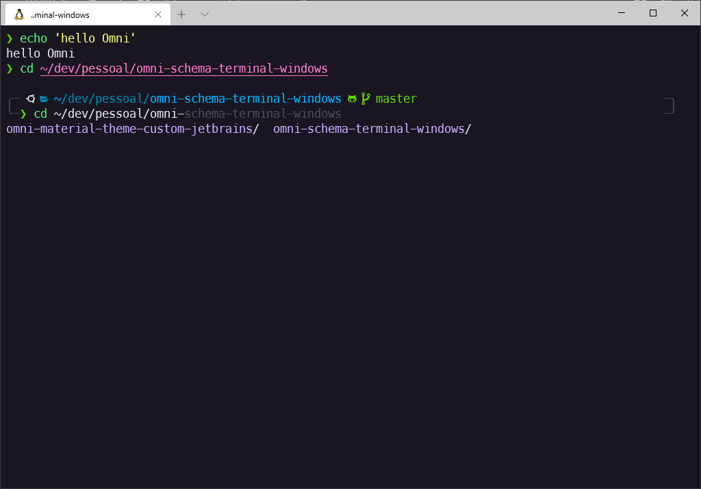
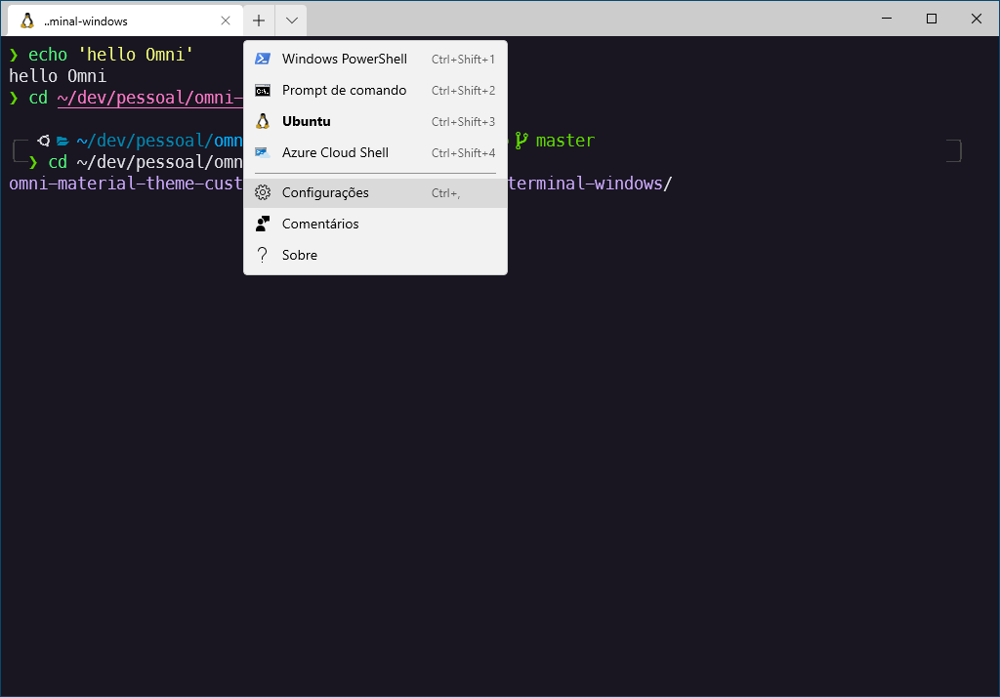
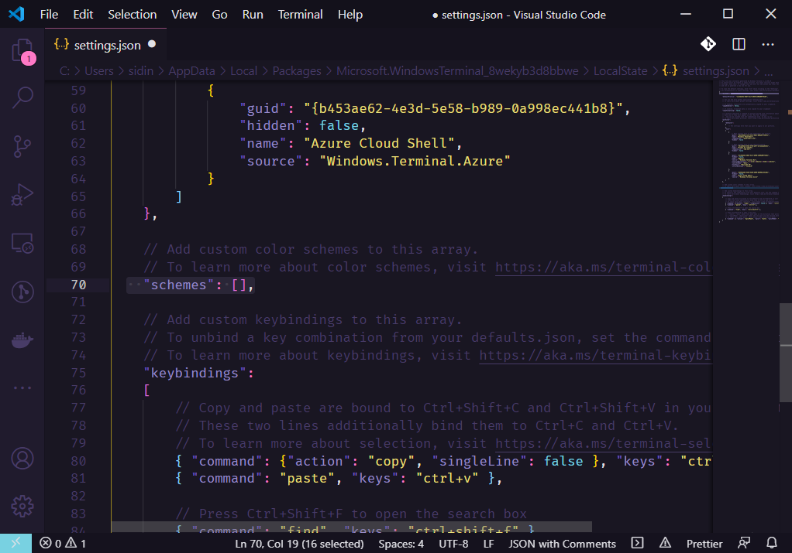
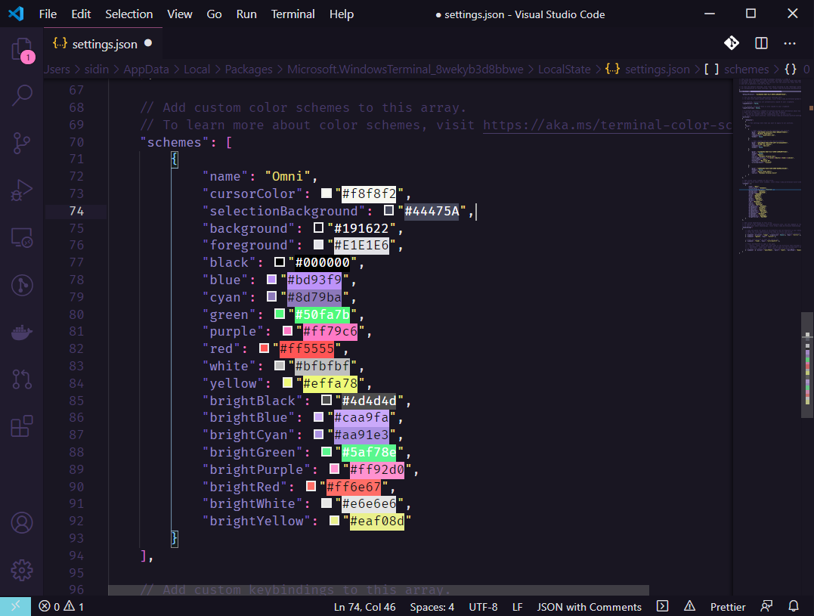
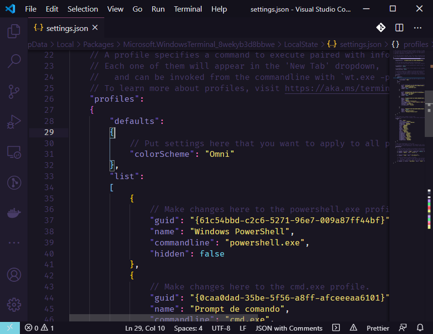

# Omni for [Windows Terminal](https://www.microsoft.com/pt-br/p/windows-terminal/9n0dx20hk701?activetab=pivot:overviewtab)

---

## What is Omni?

[Omni](https://github.com/getomni) is a theme created and maintained by the [Rocketseat](https://rocketseat.com.br/) team, based on the darcula theme.

#### For more themes visit: https://github.com/getomni

---

## Omni for Windows Terminal
This theme Omni is maintained by the Rockeseat. 
And it was adapted for windows terminal by.

 |
--- |  
Sidinei Silva |

---

## Include theme

1. Start Windows Terminal 

2. Open Settings `ctrl+,` or 

3. Search array `"schemes": []`  

4. Include Omni in schemes. 

5. Save and select Omni profile->default. 

## License

MIT License